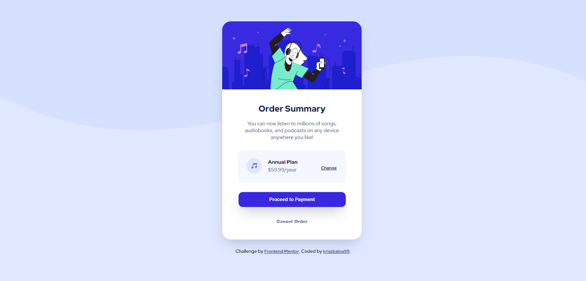

# Frontend Mentor - Order summary card solution

This is a solution to the [Order summary card challenge on Frontend Mentor](https://www.frontendmentor.io/challenges/order-summary-component-QlPmajDUj). Frontend Mentor challenges help you improve your coding skills by building realistic projects. 

## Overview

### The challenge

Users should be able to:

- See hover states for interactive elements

### Screenshot



### Links

- Solution URL: https://gist.github.com/kriszbalog99/6dbbf74760d4fc0f2dcee394846dc09c

## My process


### What I learned

That I have to call in different font-weights, it's not enought just to invite/import only the font itself.

```html
<link href="https://fonts.googleapis.com/css2?family=Red+Hat+Display:wght@500;700;800;900&display=swap" rel="stylesheet">
```

I still have problems with weight, due to my small monitor. I have to use smaller font, but it falls below 11px, so weight doesn't work properly.

## Author

- Website - [Add your name here](https://www.riseappstudio.com)
- Frontend Mentor - [@yourusername](https://www.frontendmentor.io/profile/kriszbalog99)
